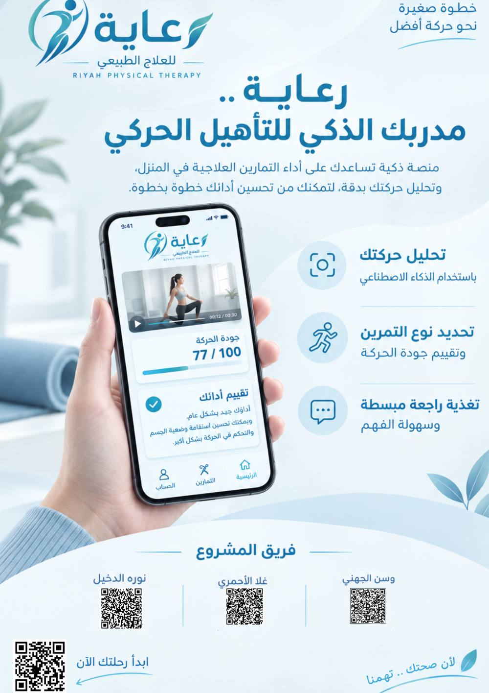
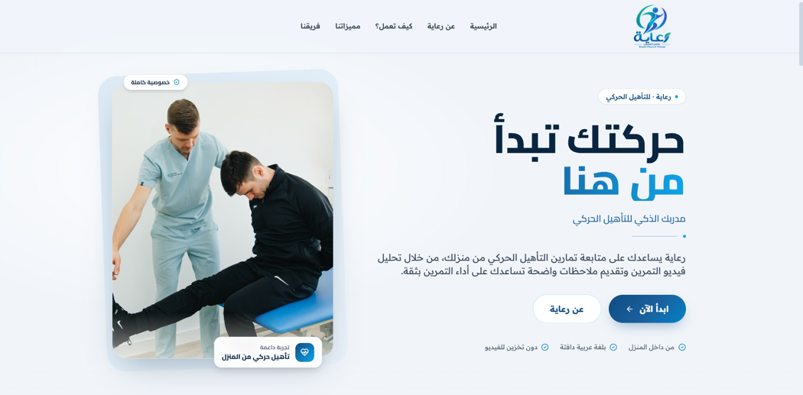
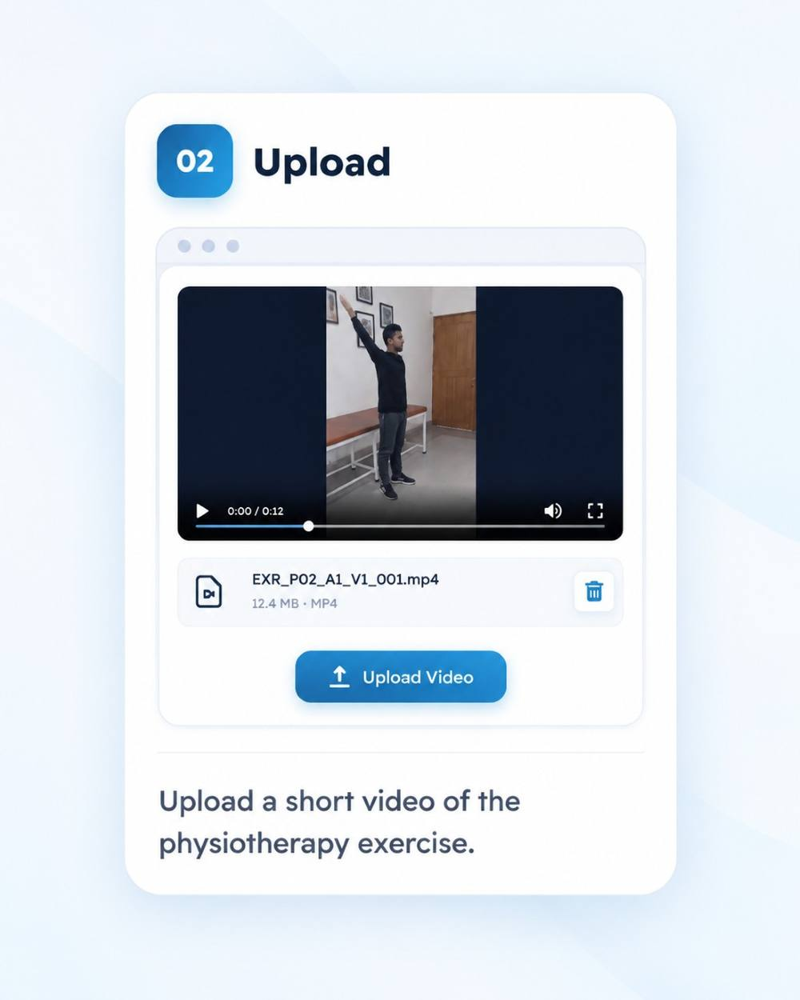
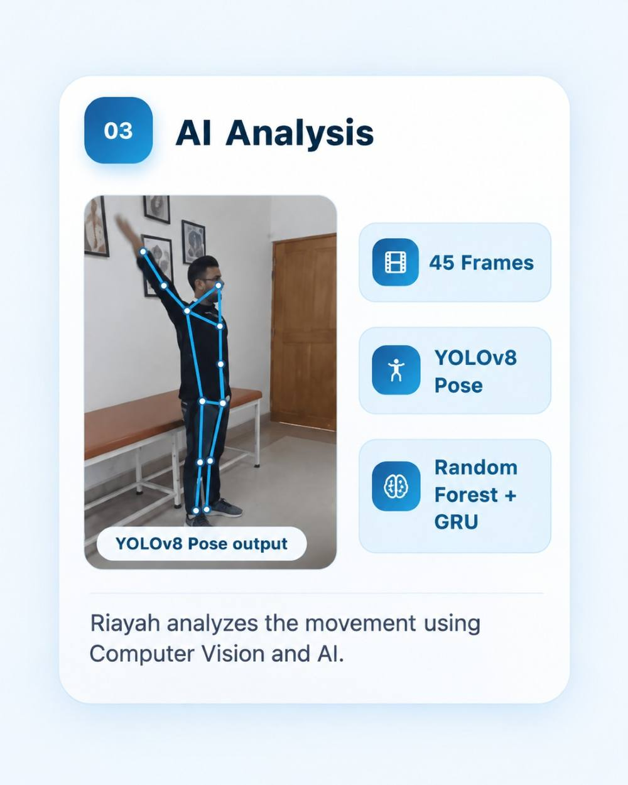
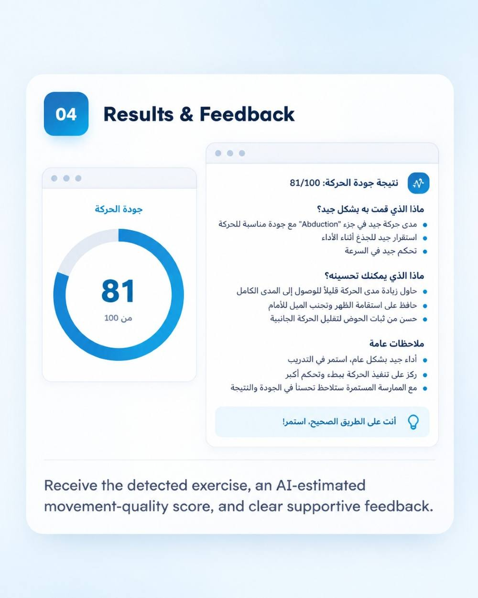

# Riayah | رعاية

<p align="center">
  
</p>

<p align="center">
  <b>AI-Powered Home Physiotherapy Support Platform</b>
</p>

Riayah is an AI-powered home physiotherapy support platform designed to help users perform rehabilitation exercises at home and receive clear feedback about their movement.

## Project Overview

The platform allows the user to upload a short physiotherapy exercise video. Riayah analyzes the movement, recognizes the exercise, estimates movement quality, and provides clear feedback in Arabic.

Riayah is designed as a support tool and does not replace a qualified physiotherapist or provide medical diagnosis.

## MVP Preview

<p align="center">
  
</p>

The Riayah web platform provides an Arabic-first experience where users can upload an exercise video and receive AI-supported movement analysis and feedback.

## How Riayah Works

### 1. Upload Video

The user uploads a short video of the physiotherapy exercise.

<p align="center">
  
</p>

### 2. AI Analysis

Riayah samples frames from the uploaded video and uses YOLOv8-Pose to detect body keypoints.

The extracted movement information is then used by machine learning and deep learning models to recognize the exercise and estimate movement quality.

<p align="center">
  
</p>

### 3. Results & Feedback

The user receives the detected exercise, an AI-estimated movement-quality score, and clear supportive feedback in Arabic.

<p align="center">
  
</p>

## AI Pipeline

**Upload Video → Sample 45 Frames → YOLOv8-Pose → Exercise Classification → Movement Quality Estimation → Arabic Feedback**

## Models

* **YOLOv8-Pose** — Detects body keypoints from exercise videos.
* **Random Forest** — Classifies the performed physiotherapy exercise.
* **GRU** — Estimates movement quality from temporal movement features.
* **LLM** — Converts validated AI results into clear Arabic feedback.

## Key Results

* **9 physiotherapy exercises**
* **89.71% exercise classification accuracy**
* **8.39 MAE for movement quality estimation**
* **45 frames analyzed per video**
* **17 body keypoints extracted per frame**

## Technologies

**AI & Machine Learning**

* YOLOv8-Pose
* Random Forest
* GRU
* PyTorch
* Scikit-learn

**Backend**

* Python
* FastAPI
* OpenCV
* OpenAI API

**Frontend**

* React
* Tailwind CSS

## Main Features

* Upload physiotherapy exercise videos
* Detect body pose and movement
* Recognize the performed exercise
* Estimate movement quality
* Generate Arabic feedback
* Display results through a simple web interface
* Delete temporary video files after analysis

## System Flow

```text
User Uploads Video
        ↓
Temporary Video Processing
        ↓
45 Frame Sampling
        ↓
YOLOv8-Pose
        ↓
Random Forest Classification
        ↓
GRU Quality Estimation
        ↓
Structured AI Result
        ↓
LLM Arabic Feedback
        ↓
Results Displayed to User
```

## Responsible AI

Riayah was designed as a support tool rather than a medical diagnostic system.

* The movement score is presented as an **AI-estimated score**.
* The system does not diagnose injuries or medical conditions.
* LLM feedback is generated only from validated model results.
* A rule-based fallback is used if the LLM response is unavailable.
* Uploaded videos are processed temporarily and deleted after the request.
* Professional physiotherapy guidance remains essential.

## Repository Structure

```text
Riayah-AI-Physiotherapy/
│
├── MobiPhysio-backend/
│
├── raya-frontend/
│
├── notebooks/
│
├── assets/
│   ├── riayah-home.png
│   ├── riayah-upload.jpg
│   ├── riayah-analysis.jpg
│   ├── riayah-results.jpg
│   └── riayah-poster.jpg
│
└── README.md
```

## Project Purpose

The goal of Riayah is to support home physiotherapy practice by combining computer vision, machine learning, deep learning, and AI-generated feedback in one practical web experience.

The project focuses on helping users better understand their exercise performance while keeping professional physiotherapy guidance central.

## Disclaimer

Riayah is designed to support home physiotherapy practice only.

It does not provide medical diagnosis and does not replace guidance from a qualified physiotherapist.
