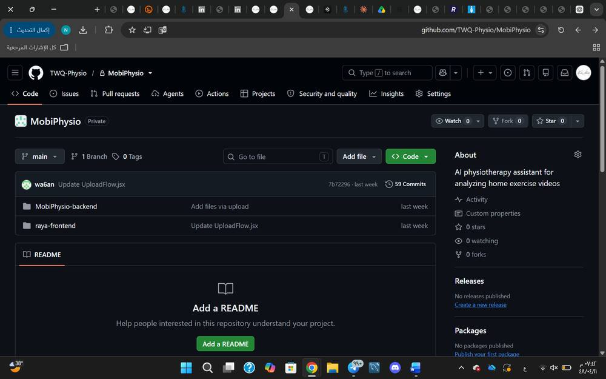
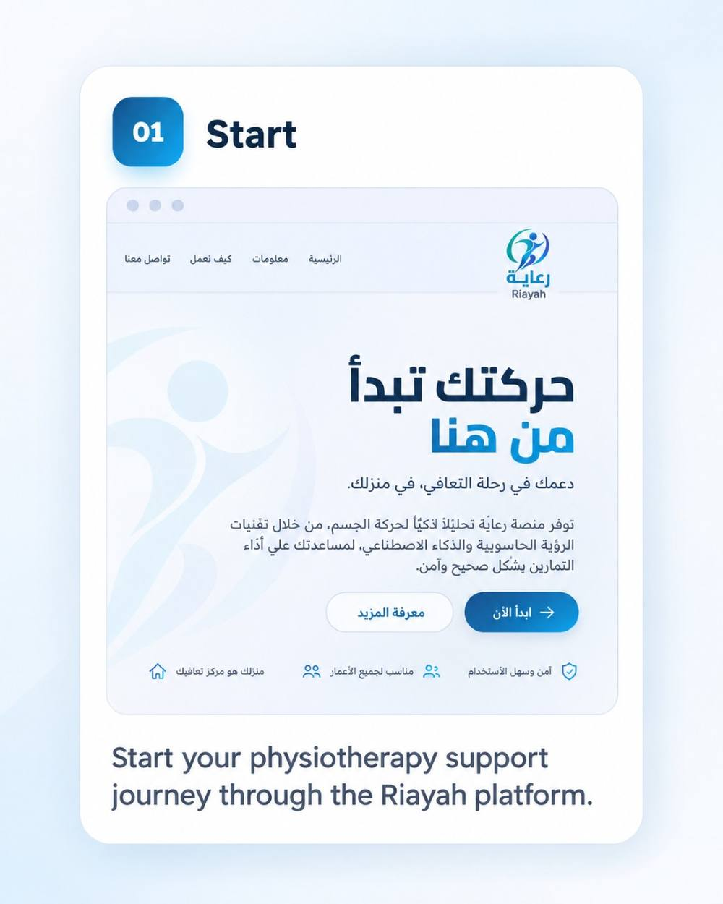

# Riayah | رعاية

Riayah is an AI-powered home physiotherapy support platform designed to help users perform rehabilitation exercises at home and receive clear feedback about their movement.

## Project Overview

The platform allows the user to upload a short physiotherapy exercise video. Riayah analyzes the movement, recognizes the exercise, estimates movement quality, and provides clear feedback in Arabic.

Riayah is designed as a support tool and does not replace a qualified physiotherapist or provide medical diagnosis.

## MVP Preview



## How Riayah Works

### 1. Start
The user starts the physiotherapy support journey through the Riayah platform.



### 2. Upload Video
The user uploads a short video of the physiotherapy exercise.


### 3. AI Analysis
Riayah uses YOLOv8-Pose to detect body keypoints, then uses machine learning and deep learning models to recognize the exercise and analyze movement quality.


### 4. Results & Feedback
The user receives the detected exercise, an AI-estimated movement-quality score, and clear supportive feedback in Arabic.


## AI Pipeline

**Upload Video → Pose Detection → Exercise Recognition → Movement Quality Analysis → Arabic Feedback**

## Models

- **YOLOv8-Pose** — Body keypoint detection
- **Random Forest** — Exercise classification
- **GRU** — Movement quality estimation
- **LLM** — Generates clear Arabic feedback from validated analysis results

## Key Results

- 9 physiotherapy exercises
- **89.71%** exercise classification accuracy
- **8.39 MAE** for movement quality estimation

## Technologies

- Python
- YOLOv8-Pose
- Scikit-learn
- PyTorch
- Random Forest
- GRU
- FastAPI
- React
- Tailwind CSS
- OpenAI API

## Main Features

- Exercise video upload
- Body pose detection
- Exercise recognition
- Movement quality estimation
- Arabic feedback
- Simple interface designed for home use

## Project Poster


## Repository Structure

```text
Riayah-AI-Physiotherapy/
├── backend/
│   └── main.py
├── assets/
├── requirements.txt
├── .gitignore
└── README.md
```

## Purpose

The goal of Riayah is to support home physiotherapy practice by using computer vision and AI to help users better understand their exercise performance and receive useful feedback.

## Disclaimer

Riayah is designed to support home physiotherapy practice only. It does not provide medical diagnosis and does not replace a qualified physiotherapist.
